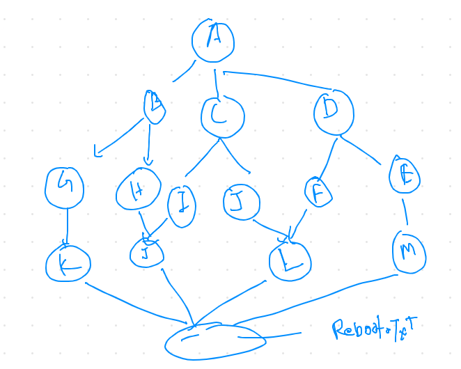
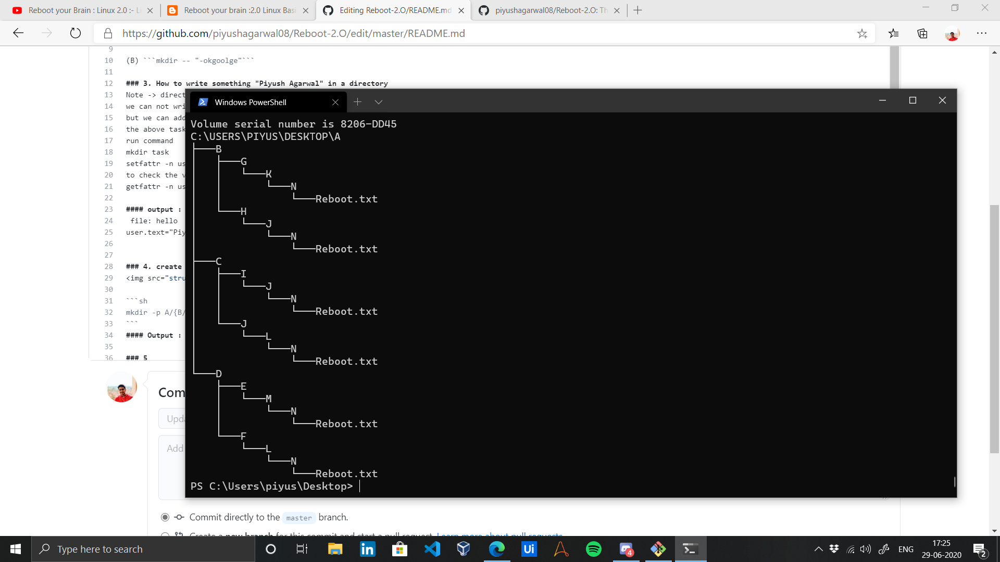

# Reboot-2.O

## Assignments

### 1. Block System call : block system call for date command and firefox that is both commands are installed but kernel rejects to run them

### 2. play with directory : (a) create a directory without name from command line  , (b) create a directory with name "-okgoogle"
(A) ```mkdir ''$'\n'``` ~> this will create a directory with ```enter sign``` as name and won't be visible in folder GUI view

(B) ```mkdir -- "-okgoolge"```

### 3. How to write something "Piyush Agarwal" in a directory
Note -> directory is a kind of file that is used to map different inode no (files)
we can not write something as a text in a directory as it is designed to store other files
but we can add some extra file or directory information just like ACL permissions
the above task can be done using setfattr command which is to declare new attribute or information within meta data of file
run command
mkdir task
setfattr -n user.text -v "Piyush Agarwal" task
to check the value , run command
getfattr -n user.text hello

#### output :
 file: hello
user.text="Piyush Agarwal"


### 4. create a directory structure 


```sh
mkdir -p A/{B/{G/K/N/Reboot.txt,H/J/N/Reboot.txt},C/{I/J/N/Reboot.txt,J/L/N/Reboot.txt},D/{F/L/N/Reboot.txt,E/M/N/Reboot.txt}}
```
#### Output :


### 5 share and files and folder 
<ul>
  <li>create two users name jack and Jill  from command line</li>
  <li>create all the data under home directory of each users </li>
<li>login with jack user and create a file name  jack.txt using vim editor and write "hello jack"</li>
  <li>from jack user also create two directories name jack1 & jack2 </li>
  <li>now login from Jill user and create a file. Jill.txt using vim editor and write "hey jiil"</li>
  <li>from Jill also create two directoires named jill1 & jill2 </li>
  </ul>
