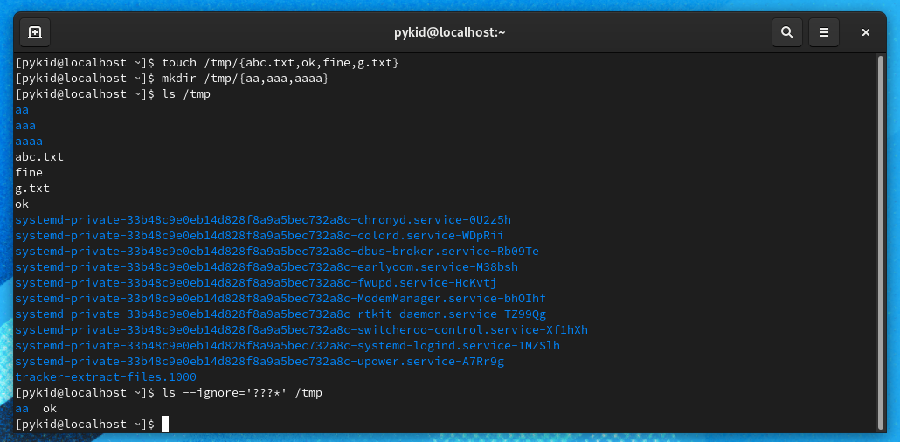

# Reboot-2.O

## Assignments

### 1. Block System call : block system call for date command and firefox that is both commands are installed but kernel rejects to run them

### 2. play with directory : (a) create a directory without name from command line  , (b) create a directory with name "-okgoogle"
(A) ```mkdir ''$'\n'``` ~> this will create a directory with ```enter sign``` as name and won't be visible in folder GUI view

(B) ```mkdir -- "-okgoolge"```

### 3. How to write something "Piyush Agarwal" in a directory
Note -> directory is a kind of file that is used to map different inode no (files)<br>
we can not write something as a text in a directory as it is designed to store other files<br>
but we can add some extra file or directory information just like ACL permissions<br>
the above task can be done using setfattr command which is to declare new attribute or information within meta data of file<br>
1. run command ```mkdir task```
2. run command ```setfattr -n user.text -v "Piyush Agarwal" task```
3. to check the value , run command ```getfattr -n user.text hello```

#### output :
```
file: hello
user.text="Piyush Agarwal"
```

### 4. create a directory structure 


```sh
mkdir -p A/{B/{G/K/N/Reboot.txt,H/J/N/Reboot.txt},C/{I/J/N/Reboot.txt,J/L/N/Reboot.txt},D/{F/L/N/Reboot.txt,E/M/N/Reboot.txt}}
```
#### Output :


### 5 share and files and folder 
1. create two users name jack and Jill  from command line
```sh
adduser jack jill
passwd jack   # set as jack
passwd jill   # set as jill
```
2. Create all the data under home directory of each users
3. login with jack user and create a file name  jack.txt using vim editor and write "hello jack"
```sh
su jack  # passwd is jack
chmod 0777 /home/jack
vim jack.txt  # enter hello jack and use :wq to exit
```
4.from jack user also create two directories name jack1 & jack2
```sh
mkdir jack{1..2}
```
5. Now login from Jill user and create a file. Jill.txt using vim editor and write "hey jiil"
```sh
su jill  # passwd is jill
chmod 0777 /home/jill
vim jill.txt  # enter hey jill and save using :wq
```
6. from Jill also create two directoires named jill1 & jill2
```sh
mkdir jill{1..2}
```
7. Important :  swap these files and directories in between users  and to swap don't use root account
```sh
cp -r /home/jack/* .
su jack # passwd is jack
cd  # switch to home directory of jack
cp -r /home/jill/* .
rm -r jack.txt jack{1..2}
cd /home/jill
rm -r jill.txt jill{1..2}
```
* Since i gave global permission to home directories of both the user, anyone was able to enter or do anything with the files and thus no root permissions were required, after work for security we should set the permissions back to default using chmod 0455 /home/jack and same for jill


### 6. Delete a particular entry from History without leaving any trace of it being deleted
```sh
history -d $((HISTCMD -1)) && history -d [no of command from history to be deleted]
```
Using the above command we can even execute an command without being traced from history as
```sh
history -d ((HISTCMD -1)) && [type your command]
```
* So basically ```HISTCMD``` stores the value of total lines in history file + 1  and thus we are just removing the latest entry before executing any other command

### 7. play with files and directories 
1. create  4 files named   abc.txt  ok  fine  g.txt  /tmp directory 
```sh
touch /tmp/{abc.txt,ok,fine,g.txt}
```
2. create  3  directories   aa aaa aaaa  under  /tmp directory 
```sh
mkdir /tmp/{aa,aaa,aaaa}
```
3. give ls command to  list the content of  /tmp directory , Condition:only list the content (file|directory)  having 2 char in their name.
```sh
ls --ignore='???*'
```
Output:


### 8. run command without any output : open terminal and type any command ~> once you press enter your output of given command must not  print ~> you are not allowed to redirect output anywhere 


### 9.  create a shell script
<ul>
  <li>create a shell script named /root/delvex.sh</li>
  <li>make sure it will run /bin/sh shell </li>
  <li>a user will be running this script my using a command name opensource</li>
  <li>when a user  run like  "opensource  time" it must give current time only</li>
  <li>when it runs like "opensource user"  it will give list of interactive shell users only</li>
 <li>when run like "opensource 100"  it must print "Hello Delvex" 100 times in interval of 1 sec</li>
  <li>if runs like  "opensource windows"  then it must shutdown </li>
  <li>if run opensource command without any parameter  then it must show out --</li>
  <ul>
    <li>name of kernel</li>
    <li>version of kernel</li>
    <li>current date in the format of  /DD/MM/YY</li>
    <li>name of OS</li>
    <li>last reboot time</li>
  </ul>
  </ul>
    
```sh
#!/bin/sh

# We will read single argument
if [ "$#" == 0 ]
then
	echo "Kernel Name: `uname`"
	echo "Kernel Version: `uname -r`"
	echo "Date: `date +%d`/`date +%m`/`date +%y`"
	echo "OS `cat /etc/os-release | head -1`"
	echo "last reboot info: "
	last reboot | head -2 | awk '{print "   " $5" "$6" "$7" "$8" "$9" "$10}'
elif [ "$1" == "time" ]
then
	date +%T
elif [ "$1" == "user" ]
then
 	users
elif [[ "$1" =~ ^[0-9]+$ ]]
then
	count=$1
	while [ $count != 0 ]
	do
		echo "Hello Delvex"
		sleep 1
		((count--))
	done
elif [[ "$1" == "windows" ]]
then
	shutdown now
fi
```

### 9. create a user will default settings
<ul>
  <li>create a user name  delvex  and password of this user will be fedora</li>
  <li>when user got created below listed things will come by default</li>
  <li>history size will be 5000</li>
  <li>history file will be  /home/delvex/myhist.txt</li>
  <li>default shell will be  /bin/sh </li>
  </ul>
* For customization required as in question, we will create an shell script to be executed for our user

```sh
su root # switch to root user
cat <<M /etc/profile.d/delvex.sh
if [ $USER == "delvex" ]
then
	HISTSIZE=5000
	HISTFILE=/home/delevx/myhist.txt
	SHELL=/bin/sh
	export HISTSIZE HISTFILE SHELL
fi
M
adduser delvex
passwd delvex # set it as fedora
```
